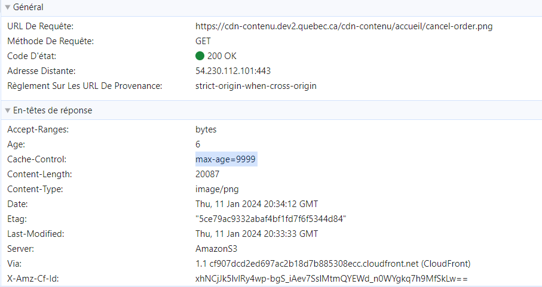

# Testing Extension tm_s3xclass

## Version française

### Vérifier les arguments

Après avoir téléchargé les images avec succès, vous devez vérifier les données en effectuant un rendu dans le frontend.
vous devriez trouver le ``CacheControl`` et le ``ContentType`` pour vous assurer que ces données ont été ajoutées lorsque nous avons téléchargé le fichier.

### Vérifier les métadonnées

Après avoir téléchargé avec succès les images, vous devez vérifier que les métadonnées du fichier fonctionnent également et qu'elles ont été ajoutées au fichier.
à partir des modules de la liste des fichiers

## English version

### Check data

After successfully upload of pictures you need to check the data by rendering in the frontend
you should find the ``CacheControl`` and ``ContentType`` to make sure that this data was added when we upload the File

### Check metadata

After successfully upload of pictures you need to check that the file metadata are working as well and added to the file
from the file list modules
